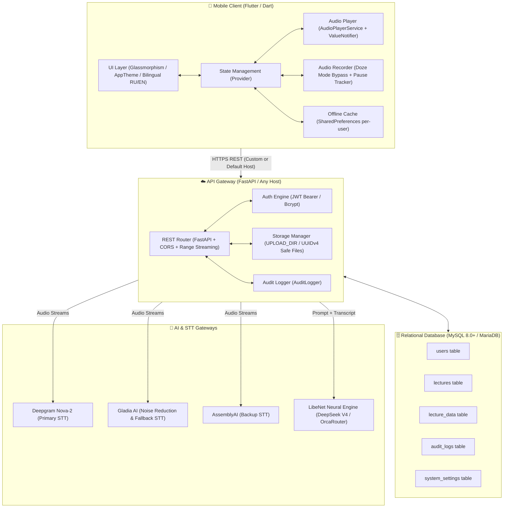

<div align="center">

# 🎓 LibeNet Lecture Assistant (LibeNetLA)
### *Next-Gen Academic AI Assistant for Students and Educators*

[](https://flutter.dev)
[](https://dart.dev)
[](https://fastapi.tiangolo.com)
[](https://python.org)
[](https://mysql.com)
[](https://docker.com)
[](https://github.com/Alvarezik/libenet-lecture-assistant/releases)
[](LICENSE)

<p align="center">
  <b>Uninterrupted Background Recording</b> • 
  <b>Multi-Engine Speech-to-Text</b> • 
  <b>No-Fluff Structured Summaries</b> • 
  <b>Interactive Timestamps & Flashcards</b> • 
  <b>Academic AI Tutor</b>
</p>

[🇬🇧 **English**](README.md) • [🇷🇺 **Русская версия**](README_RU.md)

---

</div>

## 📑 Table of Contents

- [Overview](#-overview)
- [Key Features](#-key-features)
- [System Architecture](#-system-architecture)
- [Technology Stack](#-technology-stack)
- [Repository Structure](#-repository-structure)
- [Quickstart (Local Development)](#-quickstart-local-development)
  - [Prerequisites](#prerequisites)
  - [Backend Setup (FastAPI)](#backend-setup-fastapi)
  - [Mobile Client Setup (Flutter)](#mobile-client-setup-flutter)
- [Environment Configuration (.env)](#-environment-configuration-env)
- [Database Schema (MySQL / MariaDB)](#-database-schema-mysql--mariadb)
- [Hosting & Production Deployment (100% Cloud-Agnostic)](#-hosting--production-deployment-100-cloud-agnostic)
  - [Flexible Hosting Concept](#flexible-hosting-concept)
  - [1. Docker & Docker Compose (Recommended)](#1-docker--docker-compose-recommended)
  - [2. Self-Hosted Linux VPS (Ubuntu / Debian + Systemd + Nginx)](#2-self-hosted-linux-vps-ubuntu--debian--systemd--nginx)
  - [3. PaaS Hosting (AlwaysData, Render, Railway, etc.)](#3-paas-hosting-alwaysdata-render-railway-etc)
  - [4. Changing the API Server URL in Mobile App](#4-changing-the-api-server-url-in-mobile-app)
- [Building the Release APK](#-building-the-release-apk)
- [Security & Architecture Guarantees](#-security--architecture-guarantees)
- [API Endpoints Specification](#-api-endpoints-specification)
- [License & Contributing](#-license--contributing)

---

## 🌟 Overview

**LibeNet Lecture Assistant (LibeNetLA)** is an open-source, full-stack ecosystem designed to revolutionize how students and educators capture, process, and master academic material.

Unlike generic voice recorders or basic speech-to-text apps, LibeNetLA is tailored specifically for academic lectures:
1. **Zero Fluff & Pure Essence**: The neural engine filters out professor's autobiographical stories, chatter, administrative remarks, and filler words. It extracts solely the scientific essence: definitions, formulas, laws, theorems, and classifications.
2. **Comprehensive Lecture Span**: The summary covers the full duration of the class—from the opening definitions to the concluding remarks, ensuring nothing is missed.
3. **Uncertainty & Ambiguity Tagging**: When a formula, complex foreign term, or name is muffled in the classroom audio, the model never deletes it. It flags the spot with `[Unclear/Clarify: ...]` so students know exactly what to ask during seminars.
4. **Exam Preparation on Autopilot**: Generates interactive flashcards (Q&A) and key bullet points to turn passive listening into active study.
5. **Contextual & General Academic AI Tutor**: Ask questions about the lecture directly or consult on essay outlines, formula derivations, and coding problems.
6. **Bilingual UI**: Fully localized in Russian (🇷🇺) and English (🇬🇧) with an instant switch in Settings.

---

## 🚀 Key Features

### 🎙️ Bulletproof Audio Recorder
- **Android Doze Mode Bypass**: Requests battery optimization exemption (`REQUEST_IGNORE_BATTERY_OPTIMIZATIONS`) ensuring continuous background recording even with the screen turned off.
- **Pause & Silence Detection**: Tracks pause events with precise timestamps and passes them to the AI prompt to prevent merging unrelated speech segments.
- **Per-User Draft Isolation**: Unsaved draft recordings are stored separately per user account, preventing accidental loss or data leakage.

### ⚡ Multi-Engine STT Architecture
- **Deepgram Nova-2 (RU/EN)**: Ultra-fast streaming transcription with word-level timestamps.
- **Gladia Audio AI**: Advanced acoustic noise cancellation for reverberant university lecture halls.
- **AssemblyAI Universal**: Automatic failover gateway ensuring 99.9% transcription reliability.

### 🧠 LibeNet Neural Engine (LLM Pipeline)
- Outputs structured, publication-grade Markdown (headers, lists, bold formulas).
- Generates interactive flashcards for spaced repetition.
- Extracts concise key takeaways.
- Fully free of emojis and conversational chatter.

### 🎧 Academic Media Player
- Click any timestamp in the text to jump the audio playback directly to that exact second.
- Variable playback speeds: `0.75x`, `1.0x`, `1.25x`, `1.5x`, `2.0x`.
- Butter-smooth scrolling: Decoupled stream listeners with `ValueNotifier` architecture eliminate list rebuild lags.
- Supports `HTTP 206 Partial Content` with `Accept-Ranges: bytes` for instantaneous seeking.
- One-click original `.m4a` audio download and export.

### 💬 Academic AI Assistant
- **Lecture Chat**: Converse strictly within the boundaries and context of the specific recorded lecture.
- **General Academic Chat**: Topics for exam prep, essay outlines, ELI5 conceptual explanations, math, and code.
- "Forget All" button to clear conversation context instantly.

### 📴 Isolated Offline Mode
- Read summaries and flashcards without any internet connection.
- Local cache is cryptographically partitioned per `userId`.

### 🛡️ Admin Dashboard & Live Telemetry
- System statistics (users, audio storage, total hours processed).
- User and role management (`student`, `admin`).
- Real-time audit log viewer with level filtering (`INFO`, `WARN`, `ERROR`) and clipboard export.
- Integrated ping & healthcheck for all connected AI endpoints.

---

## 🏗️ System Architecture



---

## 💻 Technology Stack

| Component | Technology | Role |
| :--- | :--- | :--- |
| **Mobile App** | **Flutter 3.7+ / Dart 3.7+** | Cross-platform client for Android & iOS |
| **State Management** | **Provider 6.1+** | Clean separation of business logic and UI |
| **Audio Core** | **Audioplayers 6.6+ & Record 5.1+** | Low-level background audio recording & streaming |
| **Backend** | **FastAPI (Python 3.11+)** | High-performance asynchronous REST API |
| **Database** | **MySQL 8.0+ / MariaDB / PyMySQL** | Relational database with strict foreign keys & indexes |
| **Speech-to-Text** | **Deepgram Nova-2, Gladia, AssemblyAI** | Triple failover STT pipeline |
| **Neural Engine** | **OrcaRouter / DeepSeek V4 Flash** | Academic summarization & flashcard extraction |
| **Infrastructure** | **Docker / VPS / AlwaysData / Cloud** | 100% cloud-agnostic deployment |

---

## 📂 Repository Structure

```
libenet-lecture-assistant/
├── lib/                               # Flutter Mobile Client Source
│   ├── core/                          # Core Architecture
│   │   ├── constants/                 # API endpoints, dynamic host, app config
│   │   ├── localization/              # Bilingual translations (RU & EN)
│   │   ├── services/                  # Audio player, recorder, API, cache, notifications
│   │   └── theme/                     # AppTheme, glassmorphism, responsive colors
│   ├── models/                        # Typed data models (User, Lecture, Log, Stats)
│   ├── providers/                     # Providers (Auth, Lecture, Admin, Locale)
│   ├── screens/                       # Presentation screens
│   │   ├── admin/                     # Admin dashboard, audit logs
│   │   ├── auth/                      # Login & Registration
│   │   ├── chat/                      # General AI Tutor chat
│   │   ├── home/                      # Main bottom navigation shell
│   │   ├── lectures/                  # Lecture list, details, flashcards, transcript
│   │   ├── profile/                   # Profile, language switcher, server host config
│   │   └── record/                    # Recording studio with background service
│   ├── widgets/                       # Reusable UI widgets
│   └── main.dart                      # Application entry point, global error handler
├── server/                            # Official Backend Package
│   ├── main.py                        # FastAPI server application
│   ├── requirements.txt               # Python dependencies
│   └── .env.example                   # Clean template for environment variables
├── android/                           # Android native module & manifest
├── assets/                            # Brand icons, logo, typography
├── LibeNetLA.apk                      # Ready-to-install Android Release APK (v2.2)
├── LICENSE                            # MIT License
├── pubspec.yaml                       # Flutter package specifications
├── README.md                          # Primary English Documentation
└── README_RU.md                       # Russian Documentation Mirror
```

---

## 🛠️ Quickstart (Local Development)

### Prerequisites
- **Flutter SDK**: `>= 3.7.0`
- **Dart SDK**: `>= 3.7.0`
- **Python**: `>= 3.10` (recommended `3.11`)
- **MySQL**: `>= 8.0` or **MariaDB**
- **Android Studio / VS Code** with Flutter extensions

---

### Backend Setup (FastAPI)

1. **Clone the repository:**
   ```bash
   git clone https://github.com/Alvarezik/libenet-lecture-assistant.git
   cd libenet-lecture-assistant
   ```

2. **Create and activate a virtual environment:**
   ```bash
   # Linux / macOS
   python3 -m venv venv
   source venv/bin/activate

   # Windows
   python -m venv venv
   .\venv\Scripts\activate
   ```

3. **Install dependencies:**
   ```bash
   pip install -r server/requirements.txt
   ```

4. **Setup Environment Variables:**
   Copy `server/.env.example` to `server/.env` (or project root) and fill in your database credentials:
   ```bash
   cp server/.env.example server/.env
   ```

5. **Start the development server:**
   ```bash
   uvicorn server.main:app --host 0.0.0.0 --port 8000 --reload
   ```
   Interactive Swagger documentation is available at: `http://localhost:8000/docs`.

---

### Mobile Client Setup (Flutter)

1. **Fetch dependencies:**
   ```bash
   flutter pub get
   ```

2. **Check your Flutter installation:**
   ```bash
   flutter doctor
   ```

3. **Launch on an emulator or physical device:**
   ```bash
   flutter run
   ```
   *(By default, the app connects to the official cloud backend. You can point it to `http://localhost:8000` or any custom IP in **Profile > Settings > API Server Host** without changing any code!)*

---

## ⚙️ Environment Configuration (.env)

Create a `.env` file for your backend deployment:

```ini
# ==================== DATABASE CONFIGURATION ====================
DB_HOST=127.0.0.1
DB_PORT=3306
DB_USER=libenet_user
DB_PASS=your_secure_password
DB_NAME=libenet_db

# ==================== SECURITY & JWT ====================
SECRET_KEY=change_this_to_a_random_secure_hex_in_production
JWT_SECRET=change_this_to_a_random_secure_hex_in_production
JWT_ALGORITHM=HS256
JWT_EXPIRE_DAYS=30

# ==================== AI & STT API KEYS ====================
# Deepgram Nova-2 (Streaming STT)
DEEPGRAM_API_KEY=your_deepgram_api_key

# Gladia AI (Audio Enhancement & Secondary STT)
GLADIA_API_KEY=your_gladia_api_key

# AssemblyAI (Backup Failover STT)
ASSEMBLYAI_API_KEY=your_assemblyai_api_key

# OrcaRouter (LibeNet Neural Engine / LLM)
ORCAROUTER_API_KEY=your_orcarouter_api_key
ORCAROUTER_MODEL=deepseek/deepseek-v4-flash-free

# ==================== FILE STORAGE ====================
UPLOAD_DIR=/app/uploads
```

---

## 🗄️ Database Schema (MySQL / MariaDB)

Execute the following DDL statements to set up your tables:

```sql
-- 1. Users Table
CREATE TABLE IF NOT EXISTS users (
    id INT AUTO_INCREMENT PRIMARY KEY,
    username VARCHAR(64) NOT NULL UNIQUE,
    email VARCHAR(128) NOT NULL UNIQUE,
    password_hash VARCHAR(255) NOT NULL,
    full_name VARCHAR(128) DEFAULT '',
    role VARCHAR(32) DEFAULT 'student',
    is_active TINYINT(1) DEFAULT 1,
    created_at DATETIME DEFAULT CURRENT_TIMESTAMP,
    updated_at DATETIME DEFAULT CURRENT_TIMESTAMP ON UPDATE CURRENT_TIMESTAMP
) ENGINE=InnoDB DEFAULT CHARSET=utf8mb4;

-- 2. Lectures Table
CREATE TABLE IF NOT EXISTS lectures (
    id INT AUTO_INCREMENT PRIMARY KEY,
    user_id INT NOT NULL,
    title VARCHAR(255) NOT NULL,
    subject VARCHAR(128) DEFAULT '',
    teacher_name VARCHAR(128) DEFAULT '',
    audio_filename VARCHAR(255) DEFAULT NULL,
    duration_seconds INT DEFAULT 0,
    file_size_bytes BIGINT DEFAULT 0,
    status VARCHAR(32) DEFAULT 'draft',
    error_message VARCHAR(255) DEFAULT NULL,
    created_at DATETIME DEFAULT CURRENT_TIMESTAMP,
    updated_at DATETIME DEFAULT CURRENT_TIMESTAMP ON UPDATE CURRENT_TIMESTAMP,
    FOREIGN KEY (user_id) REFERENCES users(id) ON DELETE CASCADE,
    INDEX idx_user_lectures (user_id, id DESC)
) ENGINE=InnoDB DEFAULT CHARSET=utf8mb4;

-- 3. Lecture Transcripts & Summaries Table
CREATE TABLE IF NOT EXISTS lecture_data (
    lecture_id INT PRIMARY KEY,
    raw_transcript MEDIUMTEXT,
    timed_transcript MEDIUMTEXT,
    clean_summary MEDIUMTEXT,
    key_points TEXT,
    flashcards MEDIUMTEXT,
    detected_language VARCHAR(16) DEFAULT 'ru',
    updated_at DATETIME DEFAULT CURRENT_TIMESTAMP ON UPDATE CURRENT_TIMESTAMP,
    FOREIGN KEY (lecture_id) REFERENCES lectures(id) ON DELETE CASCADE
) ENGINE=InnoDB DEFAULT CHARSET=utf8mb4;

-- 4. Audit Logs Table
CREATE TABLE IF NOT EXISTS audit_logs (
    id INT AUTO_INCREMENT PRIMARY KEY,
    user_id INT DEFAULT NULL,
    username VARCHAR(64) DEFAULT 'Anonymous',
    action VARCHAR(64) NOT NULL,
    category VARCHAR(32) DEFAULT 'general',
    level VARCHAR(16) DEFAULT 'INFO',
    details TEXT,
    ip_address VARCHAR(45) DEFAULT '',
    created_at DATETIME DEFAULT CURRENT_TIMESTAMP,
    INDEX idx_log_level (level, id DESC)
) ENGINE=InnoDB DEFAULT CHARSET=utf8mb4;

-- 5. System Settings Table (Dynamic API Keys & Configs)
CREATE TABLE IF NOT EXISTS system_settings (
    key_name VARCHAR(64) PRIMARY KEY,
    key_value TEXT,
    description VARCHAR(255) DEFAULT '',
    updated_at DATETIME DEFAULT CURRENT_TIMESTAMP ON UPDATE CURRENT_TIMESTAMP
) ENGINE=InnoDB DEFAULT CHARSET=utf8mb4;
```

---

## 🌐 Hosting & Production Deployment (100% Cloud-Agnostic)

### Flexible Hosting Concept
LibeNetLA is designed from the ground up to be **completely independent of any specific cloud vendor**. You are never locked into AlwaysData, AWS, or any provider:
- Deploy anywhere: **Docker**, **Kubernetes**, **Ubuntu/Debian VPS**, **Hetzner**, **DigitalOcean**, **AWS EC2**, **Render**, **Railway**, or **on-premise university servers**.
- The client app allows changing the server URL at runtime.

---

### 1. Docker & Docker Compose (Recommended)

#### `Dockerfile`:
```dockerfile
FROM python:3.11-slim

WORKDIR /app

RUN apt-get update && apt-get install -y --no-install-recommends \
    gcc libmariadb-dev-compat ffmpeg && \
    rm -rf /var/lib/apt/lists/*

COPY server/requirements.txt .
RUN pip install --no-cache-dir -r requirements.txt

COPY server/main.py ./main.py

RUN mkdir -p /app/uploads && chmod 777 /app/uploads

EXPOSE 8000

CMD ["uvicorn", "main:app", "--host", "0.0.0.0", "--port", "8000"]
```

#### `docker-compose.yml`:
```yaml
version: '3.8'

services:
  backend:
    build: .
    restart: always
    ports:
      - "8000:8000"
    environment:
      - DB_HOST=db
      - DB_PORT=3306
      - DB_USER=libenet
      - DB_PASSWORD=secret_db_password
      - DB_NAME=libenet_db
      - UPLOAD_DIR=/app/uploads
      - DEEPGRAM_API_KEY=${DEEPGRAM_API_KEY}
      - ORCAROUTER_API_KEY=${ORCAROUTER_API_KEY}
      - GLADIA_API_KEY=${GLADIA_API_KEY}
      - ASSEMBLYAI_API_KEY=${ASSEMBLYAI_API_KEY}
    volumes:
      - audio_storage:/app/uploads
    depends_on:
      - db

  db:
    image: mariadb:10.11
    restart: always
    environment:
      MYSQL_ROOT_PASSWORD: root_db_password
      MYSQL_DATABASE: libenet_db
      MYSQL_USER: libenet
      MYSQL_PASSWORD: secret_db_password
    volumes:
      - mariadb_storage:/var/lib/mysql

volumes:
  audio_storage:
  mariadb_storage:
```

Launch with:
```bash
docker-compose up -d --build
```

---

### 2. Self-Hosted Linux VPS (Ubuntu / Debian + Systemd + Nginx)

#### Systemd Service (`/etc/systemd/system/libenet.service`):
```ini
[Unit]
Description=LibeNet Lecture Assistant Backend Service
After=network.target

[Service]
User=www-data
Group=www-data
WorkingDirectory=/var/www/libenet
EnvironmentFile=/var/www/libenet/.env
ExecStart=/var/www/libenet/venv/bin/uvicorn main:app --host 127.0.0.1 --port 8000 --workers 4
Restart=always
RestartSec=5

[Install]
WantedBy=multi-user.target
```

```bash
sudo systemctl daemon-reload
sudo systemctl enable --now libenet
```

#### Nginx Configuration (`/etc/nginx/sites-available/libenet`):
```nginx
server {
    server_name api.youruniversity.edu;
    client_max_body_size 250M;

    location / {
        proxy_pass http://127.0.0.1:8000;
        proxy_set_header Host $host;
        proxy_set_header X-Real-IP $remote_addr;
        proxy_set_header X-Forwarded-For $proxy_add_x_forwarded_for;
        proxy_set_header X-Forwarded-Proto $scheme;

        # Enable byte range streaming for lecture audio
        proxy_buffering off;
        proxy_read_timeout 300s;
        proxy_send_timeout 300s;
    }

    listen 443 ssl;
    ssl_certificate /etc/letsencrypt/live/api.youruniversity.edu/fullchain.pem;
    ssl_certificate_key /etc/letsencrypt/live/api.youruniversity.edu/privkey.pem;
}
```

---

### 3. PaaS Hosting (AlwaysData, Render, Railway, etc.)
- Simply configure environment variables in your provider's dashboard matching `.env.example`.
- Ensure the upload directory points to a persistent volume disk.

---

### 4. Changing the API Server URL in Mobile App
1. Open the LibeNet app on your phone.
2. Go to the **Profile** tab.
3. Tap on **"API Server Host"**.
4. Enter your custom backend address (e.g. `https://api.youruniversity.edu` or `http://192.168.1.15:8000`).
5. Tap **"Test Ping"** to verify connection, then **"Save"**.
6. The app instantly connects to your own server! You can reset to the default server anytime in one click.

---

## 📦 Building the Release APK

To build an optimized Android release package:

```bash
flutter build apk --release --no-tree-shake-icons
```
The compiled file is located at: `build/app/outputs/flutter-apk/app-release.apk`.

> [!TIP]
> **Windows Path Unicode Note:**
> If your Windows username or workspace folder contains non-ASCII characters, use our helper build script:
> ```bash
> python scratch/build_apk_ascii.py
> ```
> This automatically handles path mapping and copies the final `LibeNetLA.apk` to your project root.

---

## 🔒 Security & Architecture Guarantees

- **Zero Hardcoded Secrets**: No database passwords or API keys are committed to Git. Everything is read through isolated `.env` environment variables.
- **Argon2 / Bcrypt Password Hashing**: Passwords are never stored in plaintext.
- **JWT Authentication**: Secure token lifecycle with automatic `HTTP 401 Unauthorized` session cleanup.
- **Path Traversal Protection**: Uploaded audio files are named using random `UUIDv4` hashes.
- **Orphan File Cleanup**: Deleting a user or lecture cascades to permanently remove all associated physical audio files from the server's disk storage.

---

## 📡 API Endpoints Specification

| Method | Route | Access | Description |
| :--- | :--- | :--- | :--- |
| `POST` | `/api/auth/register` | Public | Register new student account |
| `POST` | `/api/auth/login` | Public | Authenticate user & return JWT token |
| `GET` | `/api/auth/me` | User | Get profile of logged-in user |
| `GET` | `/api/lectures` | User | List all lectures belonging to user |
| `POST` | `/api/lectures` | User | Create a new lecture entry |
| `POST` | `/api/lectures/{id}/upload-audio` | User | Upload recorded lecture audio |
| `POST` | `/api/lectures/{id}/transcribe` | User | Execute multi-engine speech recognition |
| `POST` | `/api/lectures/{id}/summarize` | User | Generate fluff-free academic summary & flashcards |
| `GET` | `/api/audio/{filename}` | Public/User | Stream audio with byte range seek support |
| `POST` | `/api/lectures/{id}/chat` | User | Contextual Q&A on specific lecture materials |
| `POST` | `/api/lectures/0/chat` | User | General academic AI assistant conversation |
| `GET` | `/api/admin/stats` | Admin | Server statistics & storage telemetry |
| `GET` | `/api/admin/users` | Admin | User management & access control |
| `GET` | `/api/admin/logs` | Admin | Filterable system audit logs |
| `GET` | `/api/health` | Public | System status and API healthcheck |

---

## 📄 License & Contributing

Distributed under the **MIT License**.

```
MIT License
Copyright (c) 2026 LibeNet Team (https://github.com/Alvarezik/libenet-lecture-assistant)

Permission is hereby granted, free of charge, to any person obtaining a copy
of this software and associated documentation files...
```

You are completely free to use, modify, and deploy this software. When redistributing or publishing derivatives, the original copyright notice to **LibeNet Team** must be preserved.

<div align="center">
  <sub>Built with ❤️ for students and educators worldwide 🎓</sub>
</div>
