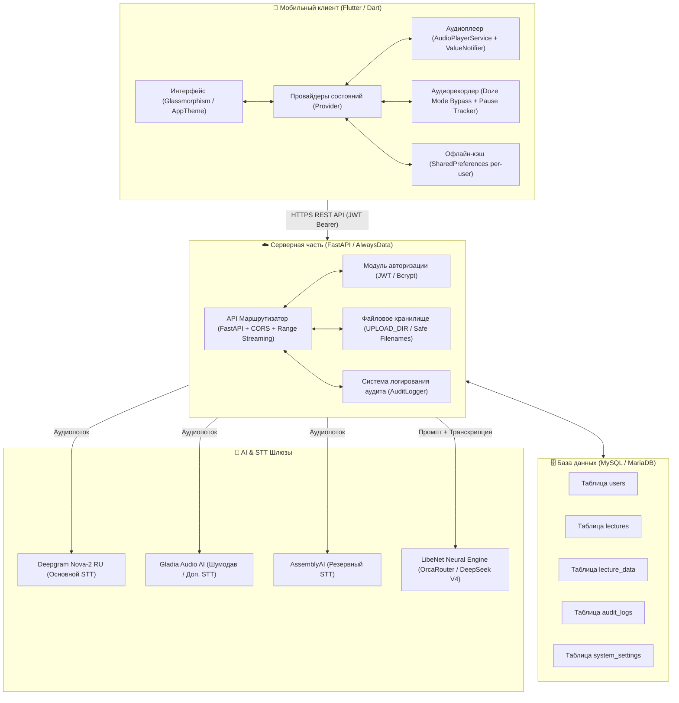

<div align="center">

# 🎓 LibeNet Lecture Assistant (LibeNetLA)
### *Интеллектуальный академический ассистент для студентов и преподавателей*

[](https://flutter.dev)
[](https://dart.dev)
[](https://fastapi.tiangolo.com)
[](https://python.org)
[](https://mysql.com)
[](https://github.com)
[](LICENSE)

<p align="center">
  <b>Запись лекций без сбоев</b> • 
  <b>Мульти-шлюзовое распознавание речи (STT)</b> • 
  <b>Академический AI-конспект без «воды»</b> • 
  <b>Интерактивные таймкоды и флеш-карточки</b> • 
  <b>Персональный AI-тьютор</b>
</p>

---

<div align="center">

[🇬🇧 **Read in English**](README.md) • [🇷🇺 **Читать на русском**](README_RU.md)

</div>


</div>

## 📑 Содержание

- [Обзор проекта](#-обзор-проекта)
- [Ключевые возможности](#-ключевые-возможности)
- [Архитектура системы](#-архитектура-системы)
- [Стек технологий](#-стек-технологий)
- [Структура репозитория](#-структура-репозитория)
- [Быстрый старт (Локальная разработка)](#-быстрый-старт-локальная-разработка)
  - [Требования](#требования)
  - [Настройка бэкенда (FastAPI)](#настройка-бэкенда-fastapi)
  - [Настройка мобильного клиента (Flutter)](#настройка-мобильного-клиента-flutter)
- [Конфигурация окружения (.env)](#-конфигурация-окружения-env)
- [Схема базы данных (MySQL)](#-схема-базы-данных-mysql)
- [Развертывание в продакшн (Production Deployment)](#-развертывание-в-продакшн-production-deployment)
  - [1. Деплой на AlwaysData (Текущий хостинг)](#1-деплой-на-alwaysdata-текущий-хостинг)
  - [2. Деплой на собственный VPS (Ubuntu + Nginx + Systemd)](#2-деплой-на-собственный-vps-ubuntu--nginx--systemd)
  - [3. Деплой через Docker & Docker Compose](#3-деплой-через-docker--docker-compose)
- [Сборка релизного Android APK](#-сборка-релизного-android-apk)
- [Безопасность и стабильность](#-безопасность-и-стабильность)
- [API Спецификация эндпоинтов](#-api-спецификация-эндпоинтов)
- [Лицензия и контакты](#-лицензия-и-контакты)

---

## 🌟 Обзор проекта

**LibeNet Lecture Assistant (LibeNetLA)** — это высокотехнологичная экосистема, созданная для кардинального изменения процесса обучения в университетах и колледжах.

В отличие от стандартных диктофонов и базовых транскрибаторов, LibeNetLA решает ключевые проблемы студента:
1. **Никакой «воды»**: Нейросеть автоматически отсекает биографические отступления лектора, организационные объявления и слова-паразиты, оставляя только суть — определения, классификации, законы, формулы и теоремы.
2. **Полный охват материала**: Конспект покрывает материал пары от первой минуты до итоговых выводов преподавателя в конце пары.
3. **Маркировка сомнительных моментов**: Если термин или формула звучали неразборчиво, система не вырезает их, а выделяет специальным тегом `[Неразборчиво/Уточнить: ...]`, чтобы студент мог переспросить на семинаре.
4. **Готовность к сессии**: На основе материала автоматически формируются проверочные флеш-карточки (вопрос/ответ) и ключевые тезисы.
5. **AI-тьютор**: Возможность задавать вопросы по материалу лекции или общаться с общим академическим консультантом.

---

## 🚀 Ключевые возможности

### 🎙️ Интеллектуальный рекордер лекций
- **Обход Doze Mode Android**: Запрос исключения из оптимизации батареи (`REQUEST_IGNORE_BATTERY_OPTIMIZATIONS`) предотвращает «засыпание» микрофона при выключенном экране.
- **Детекция пауз и тишины**: Фиксация временных меток пауз для передачи контекста нейросети (чтобы не склеивать логически разные фрагменты).
- **Изолированное сохранение черновиков**: Защита от потери несохраненной записи при звонках или внезапном закрытии приложения с привязкой к конкретному пользователю.

### ⚡ Мульти-шлюзовая STT Архитектура
- **Deepgram Nova-2 (RU)**: Высокоскоростное потоковое распознавание с пословными таймкодами.
- **Gladia Audio AI**: Мощное шумоподавление и фильтрация фонового гула аудитории.
- **AssemblyAI Universal RU**: Отказоустойчивый резервный контур при сбоях основного провайдера.

### 🧠 LibeNet Neural Engine (LLM)
- Формирование структурированного конспекта в профессиональном Markdown (с формулами, списками и жирными акцентами).
- Автоматическая генерация интерактивных флеш-карточек для запоминания.
- Извлечение главных выводов (Key Points).
- Полная очистка от эмодзи и разговорного мусора.

### 🎧 Академический медиаплеер
- Мгновенный переход к нужному фрагменту аудио по клику на таймкод в тексте.
- Скорость воспроизведения от 0.75x до 2.0x.
- Устранение лагов при скролле (реактивная архитектура на `ValueNotifier`).
- Поддержка частичной дозагрузки аудио (`HTTP 206 Partial Content` и `Accept-Ranges`).
- Экспорт и скачивание оригинального файла аудио `.m4a` в один клик.

### 💬 Академический AI-консультант
- **Чат по лекции**: Задавайте вопросы строго по контексту прослушанного материала.
- **Общий AI-чат**: Вкладка помощи в учебе (подготовка к экзаменам, составление плана эссе, объяснение сложных формул и кода).
- Кнопка «Забыть всё» для мгновенного сброса контекста.

### 📴 Изолированный Offline-режим
- Автономный просмотр ранее загруженных лекций без доступа к интернету.
- Раздельные хранилища кэша для разных пользователей на одном телефоне.

### 🛡️ Панель администратора (Admin Dashboard)
- Аналитика и статистика сервиса (пользователи, часы аудио, объем хранилища).
- Управление учетными записями, ролями (`student`, `admin`) и блокировками.
- Живой журнал аудита (INFO, WARN, ERROR) с поиском и копированием в буфер.
- Мониторинг работоспособности всех подключенных AI-провайдеров.

---

## 🏗️ Архитектура системы



---

## 💻 Стек технологий

| Область | Технология | Описание |
| :--- | :--- | :--- |
| **Mobile Client** | **Flutter 3.7+ / Dart 3.7+** | Кроссплатформенный UI для Android и iOS |
| **State Management** | **Provider 6.1+** | Реактивное разделение бизнес-логики и UI |
| **Audio Engine** | **Audioplayers 6.6+ & Record 5.1+** | Низкоуровневая запись и воспроизведение аудио |
| **Backend Framework** | **FastAPI (Python 3.11+)** | Асинхронный высокопроизводительный REST API |
| **Database** | **MySQL 8.0+ / PyMySQL** | Реляционная БД со строгой ссылочной целостностью |
| **Speech-to-Text** | **Deepgram Nova-2, Gladia, AssemblyAI** | Тройной отказоустойчивый контур транскрибации |
| **Neural Engine** | **OrcaRouter (DeepSeek V4 Flash Free)** | Анализ речи, суммаризация, флеш-карточки |
| **Hosting & Infra** | **AlwaysData Cloud PaaS / WSGI** | Облачный хостинг с поддержкой SSL и Python 3.11 |

---

## 📂 Структура репозитория

```
LibeNet Lecture Assistant/
├── lib/                               # Исходный код мобильного приложения
│   ├── core/                          # Ядро приложения
│   │   ├── constants/                 # URL эндпоинтов, настройки API
│   │   ├── services/                  # Сервисы (API, Плеер, Запись, Кэш, Уведомления)
│   │   └── theme/                     # Дизайн-система, Glassmorphism, цвета
│   ├── models/                        # Data-модели (User, Lecture, Log, etc.)
│   ├── providers/                     # Менеджеры состояний (Auth, Lecture, Admin)
│   ├── screens/                       # Экраны приложения
│   │   ├── admin/                     # Панель администратора и системные логи
│   │   ├── auth/                      # Вход и регистрация
│   │   ├── chat/                      # Общий академический AI-чат
│   │   ├── home/                      # Главный навигационный контейнер
│   │   ├── lectures/                  # Список лекций и детальный просмотр конспекта
│   │   ├── profile/                   # Профиль пользователя и статус AI-сервисов
│   │   └── record/                    # Экран записи лекции с фоновым режимом
│   ├── widgets/                       # Переиспользуемые виджеты (карточки, кнопки)
│   └── main.dart                      # Точка входа приложения, Global Error Handler
├── assets/                            # Графика, логотипы, шрифты
├── android/                           # Нативный Android-проект и манифест
├── scratch_server_main.py             # Полный исходный код бэкенда (FastAPI)
├── LibeNetLA.apk                      # Готовый релизный Android APK (v2.2)
├── pubspec.yaml                       # Зависимости Flutter
└── README.md                          # Документация проекта
```

---

## 🛠️ Быстрый старт (Локальная разработка)

### Требования
- **Flutter SDK**: `>= 3.7.0`
- **Dart SDK**: `>= 3.7.0`
- **Python**: `>= 3.10` (рекомендуется `3.11`)
- **MySQL**: `>= 8.0` или **MariaDB**
- **Android Studio / VS Code** с расширениями Flutter & Dart

---

### Настройка бэкенда (FastAPI)

1. **Клонируйте репозиторий:**
   ```bash
   git clone https://github.com/Alvarezik/libenet-lecture-assistant.git
   cd libenet-lecture-assistant
   ```

2. **Создайте и активируйте виртуальное окружение Python:**
   ```bash
   # Windows
   python -m venv venv
   .\venv\Scripts\activate

   # Linux / macOS
   python3 -m venv venv
   source venv/bin/activate
   ```

3. **Установите зависимости:**
   ```bash
   pip install fastapi uvicorn pymysql python-multipart requests pydantic bcrypt pyjwt
   ```

4. **Инициализируйте базу данных MySQL:**
   - Создайте базу данных `libenet_main` (или задайте свое имя).
   - Примените SQL схему (см. раздел [Схема базы данных](#-схема-базы-данных-mysql)).

5. **Запустите локальный сервер разработки:**
   ```bash
   uvicorn scratch_server_main:app --host 0.0.0.0 --port 8000 --reload
   ```
   Документация Swagger UI будет доступна по адресу: `http://localhost:8000/docs`.

---

### Настройка мобильного клиента (Flutter)

1. **Перейдите в корень проекта и загрузите пакеты:**
   ```bash
   flutter pub get
   ```

2. **Проверьте окружение Flutter:**
   ```bash
   flutter doctor
   ```

3. **Укажите адрес бэкенда:**
   Если вы запускаете сервер локально, откройте `lib/core/constants/api_constants.dart` и укажите IP вашего компьютера в локальной сети:
   ```dart
   static const String baseUrl = 'http://192.168.1.X:8000'; // Для реального устройства
   // или 'http://10.0.2.2:8000'; // Для стандартного эмулятора Android
   ```
   *(Для работы с текущим сервером AlwaysData оставьте дефолтный URL `https://api.your-domain.com`)*.

4. **Запустите приложение:**
   ```bash
   flutter run
   ```

---

## ⚙️ Конфигурация окружения (.env)

Для безопасного управления секретами создайте файл `.env` в корне сервера:

```ini
# ==================== БАЗА ДАННЫХ ====================
DB_HOST=mysql.your-host.com
DB_PORT=3306
DB_USER=libenet_main
DB_PASSWORD=your_mysql_password
DB_NAME=libenet_main

# ==================== БЕЗОПАСНОСТЬ ====================
SECRET_KEY=your_super_secret_jwt_key_here_change_in_production
ALGORITHM=HS256
ACCESS_TOKEN_EXPIRE_MINUTES=14400

# ==================== AI & STT КЛЮЧИ ====================
# Deepgram Nova-2 (Speech-To-Text)
DEEPGRAM_API_KEY=your_deepgram_api_key

# Gladia AI (Audio Noise Cancellation & Secondary STT)
GLADIA_API_KEY=your_gladia_api_key_here

# AssemblyAI (Backup Failover STT)
ASSEMBLYAI_API_KEY=your_assemblyai_api_key

# OrcaRouter (LibeNet Neural Engine / DeepSeek V4)
ORCAROUTER_API_KEY=your_orcarouter_api_key_here
ORCAROUTER_MODEL=deepseek/deepseek-v4-flash-free

# ==================== ФАЙЛОВОЕ ХРАНИЛИЩЕ ====================
UPLOAD_DIR=/home/username/www/uploads
```

> [!TIP]
> В панели администратора LibeNetLA ключи API также можно изменять в реальном времени через таблицу `system_settings` без перезагрузки бэкенда!

---

## 🗄️ Схема базы данных (MySQL)

База данных спроектирована с учетом строгой ссылочной целостности (Foreign Keys с каскадным удалением) и индексов для быстрого поиска.

```sql
-- 1. Таблица пользователей
CREATE TABLE IF NOT EXISTS users (
    id INT AUTO_INCREMENT PRIMARY KEY,
    username VARCHAR(64) NOT NULL UNIQUE,
    email VARCHAR(128) NOT NULL UNIQUE,
    password_hash VARCHAR(255) NOT NULL,
    full_name VARCHAR(128) DEFAULT '',
    role VARCHAR(32) DEFAULT 'student',
    is_active TINYINT(1) DEFAULT 1,
    created_at DATETIME DEFAULT CURRENT_TIMESTAMP,
    updated_at DATETIME DEFAULT CURRENT_TIMESTAMP ON UPDATE CURRENT_TIMESTAMP
) ENGINE=InnoDB DEFAULT CHARSET=utf8mb4;

-- 2. Таблица лекций
CREATE TABLE IF NOT EXISTS lectures (
    id INT AUTO_INCREMENT PRIMARY KEY,
    user_id INT NOT NULL,
    title VARCHAR(255) NOT NULL,
    subject VARCHAR(128) DEFAULT '',
    teacher_name VARCHAR(128) DEFAULT '',
    audio_filename VARCHAR(255) DEFAULT NULL,
    duration_seconds INT DEFAULT 0,
    file_size_bytes BIGINT DEFAULT 0,
    status VARCHAR(32) DEFAULT 'draft', -- draft, recorded, transcribing, transcribed, summarizing, ready, error
    created_at DATETIME DEFAULT CURRENT_TIMESTAMP,
    updated_at DATETIME DEFAULT CURRENT_TIMESTAMP ON UPDATE CURRENT_TIMESTAMP,
    FOREIGN KEY (user_id) REFERENCES users(id) ON DELETE CASCADE,
    INDEX idx_user_lectures (user_id, id DESC)
) ENGINE=InnoDB DEFAULT CHARSET=utf8mb4;

-- 3. Данные транскрипции и конспекта
CREATE TABLE IF NOT EXISTS lecture_data (
    lecture_id INT PRIMARY KEY,
    raw_transcript MEDIUMTEXT,
    timed_transcript_json MEDIUMTEXT,
    clean_summary MEDIUMTEXT,
    key_points_json TEXT,
    flashcards_json MEDIUMTEXT,
    updated_at DATETIME DEFAULT CURRENT_TIMESTAMP ON UPDATE CURRENT_TIMESTAMP,
    FOREIGN KEY (lecture_id) REFERENCES lectures(id) ON DELETE CASCADE
) ENGINE=InnoDB DEFAULT CHARSET=utf8mb4;

-- 4. Журнал аудита логов
CREATE TABLE IF NOT EXISTS audit_logs (
    id INT AUTO_INCREMENT PRIMARY KEY,
    user_id INT DEFAULT NULL,
    username VARCHAR(64) DEFAULT 'Anonymous',
    action VARCHAR(64) NOT NULL,
    category VARCHAR(32) DEFAULT 'general',
    level VARCHAR(16) DEFAULT 'INFO', -- INFO, WARN, ERROR
    details TEXT,
    ip_address VARCHAR(45) DEFAULT '',
    created_at DATETIME DEFAULT CURRENT_TIMESTAMP,
    INDEX idx_log_level (level, id DESC)
) ENGINE=InnoDB DEFAULT CHARSET=utf8mb4;

-- 5. Системные настройки и динамические API-ключи
CREATE TABLE IF NOT EXISTS system_settings (
    key_name VARCHAR(64) PRIMARY KEY,
    key_value TEXT,
    description VARCHAR(255) DEFAULT '',
    updated_at DATETIME DEFAULT CURRENT_TIMESTAMP ON UPDATE CURRENT_TIMESTAMP
) ENGINE=InnoDB DEFAULT CHARSET=utf8mb4;
```

---

## 🚀 Развертывание в продакшн (Production Deployment)

### 1. Деплой на AlwaysData (Текущий хостинг)

1. Подключитесь по SSH к серверу:
   ```bash
   ssh username@ssh.your-host.com
   ```
2. Скопируйте файл бэкенда в `/home/username/www/main.py`.
3. Создайте директорию для аудиозаписей и задайте права:
   ```bash
   mkdir -p /home/username/www/uploads
   chmod 755 /home/username/www/uploads
   ```
4. В панели AlwaysData (**Web > Sites**):
   - **Type**: WSGI (или ASGI / Custom).
   - **Command**: `uvicorn main:app --uds $ALWAYS_DATA_UDS` или использование WSGI wrapper.
   - **Working directory**: `/home/username/www/`.
5. Для мгновенной перезагрузки приложения после обновления файла:
   ```bash
   touch /home/username/www/main.py
   ```

---

### 2. Деплой на собственный VPS (Ubuntu + Nginx + Systemd)

#### Шаг 1: Systemd Service (`/etc/systemd/system/libenet.service`)
```ini
[Unit]
Description=LibeNet Lecture Assistant FastAPI Backend
After=network.target

[Service]
User=www-data
Group=www-data
WorkingDirectory=/var/www/libenet
Environment="PATH=/var/www/libenet/venv/bin"
ExecStart=/var/www/libenet/venv/bin/uvicorn scratch_server_main:app --host 127.0.0.1 --port 8000 --workers 4
Restart=always
RestartSec=5

[Install]
WantedBy=multi-user.target
```

Активируйте сервис:
```bash
sudo systemctl daemon-reload
sudo systemctl enable --now libenet
```

#### Шаг 2: Конфигурация Nginx (`/etc/nginx/sites-available/libenet`)
```nginx
server {
    server_name api.yourdomain.com;
    client_max_body_size 200M; # Разрешаем загрузку длинных аудиозаписей

    location / {
        proxy_pass http://127.0.0.1:8000;
        proxy_set_header Host $host;
        proxy_set_header X-Real-IP $remote_addr;
        proxy_set_header X-Forwarded-For $proxy_add_x_forwarded_for;
        proxy_set_header X-Forwarded-Proto $scheme;

        # Поддержка частичных ответов (Range) для аудио
        proxy_cache_bypass $http_upgrade;
        proxy_buffering off;
        proxy_read_timeout 300s;
        proxy_send_timeout 300s;
    }

    listen 443 ssl;
    ssl_certificate /etc/letsencrypt/live/api.yourdomain.com/fullchain.pem;
    ssl_certificate_key /etc/letsencrypt/live/api.yourdomain.com/privkey.pem;
}
```

---

### 3. Деплой через Docker & Docker Compose

#### `Dockerfile`:
```dockerfile
FROM python:3.11-slim

WORKDIR /app

RUN apt-get update && apt-get install -y --no-install-recommends \
    gcc libmariadb-dev-compat ffmpeg && \
    rm -rf /var/lib/apt/lists/*

COPY requirements.txt .
RUN pip install --no-cache-dir -r requirements.txt

COPY scratch_server_main.py ./main.py

RUN mkdir -p /app/uploads

EXPOSE 8000

CMD ["uvicorn", "main:app", "--host", "0.0.0.0", "--port", "8000"]
```

#### `docker-compose.yml`:
```yaml
version: '3.8'

services:
  api:
    build: .
    restart: always
    ports:
      - "8000:8000"
    environment:
      - DB_HOST=db
      - DB_USER=libenet
      - DB_PASSWORD=libenet_secure_password
      - DB_NAME=libenet_db
      - UPLOAD_DIR=/app/uploads
    volumes:
      - audio_data:/app/uploads
    depends_on:
      - db

  db:
    image: mariadb:10.11
    restart: always
    environment:
      MYSQL_ROOT_PASSWORD: root_secure_password
      MYSQL_DATABASE: libenet_db
      MYSQL_USER: libenet
      MYSQL_PASSWORD: libenet_secure_password
    volumes:
      - mariadb_data:/var/lib/mysql

volumes:
  audio_data:
  mariadb_data:
```

Запуск в одну команду:
```bash
docker-compose up -d --build
```

---

## 📦 Сборка релизного Android APK

Для генерации релизного файла `.apk`:

```bash
flutter build apk --release --no-tree-shake-icons
```
Готовый файл появится по пути: `build/app/outputs/flutter-apk/app-release.apk`.

> [!IMPORTANT]
> **Нюанс Windows с кириллицей в путях:**
> Если ваш проект расположен по пути с русскими символами (например, `Рабочий стол`), инструмент сборки Gradle может завершиться ошибкой кодировки.
> В репозитории предусмотрен скрипт автоматической сборки через ASCII-директорию:
> ```bash
> python scratch/build_apk_ascii.py
> ```
> Скрипт изолированно компилирует проект и помещает готовый `LibeNetLA.apk` прямо в корень папки проекта.

---

## 🔒 Безопасность и стабильность

- **Защита от утечки учетных записей**: Пароли пользователей никогда не хранятся в открытом виде — используется алгоритм `bcrypt` с адаптивной сложностью соли.
- **JWT Сессии**: Аутентификация через токены с автоматической инвалидацией при получении `HTTP 401 Unauthorized`.
- **Защита хранилища**:
  - Имена загружаемых файлов генерируются через безопасные `UUIDv4`, предотвращая Directory Traversal атаки.
  - Проверка на 0-байтовые файлы при загрузке аудио.
  - Каскадное удаление физических аудиофайлов с сервера при удалении лекций или пользователей.
- **Отказоустойчивость нейросети**: Ответы LLM валидируются по строгой маске границ фигурных скобок `{ ... }`, что исключает поломку JSON-парсера при наличии Markdown-кода в конспекте.

---

## 📡 API Спецификация эндпоинтов

| Метод | Эндпоинт | Доступ | Описание |
| :--- | :--- | :--- | :--- |
| `POST` | `/api/auth/register` | Public | Регистрация нового студента |
| `POST` | `/api/auth/login` | Public | Авторизация и получение JWT токена |
| `GET` | `/api/auth/me` | User | Профиль текущего пользователя |
| `GET` | `/api/lectures` | User | Список лекций текущего пользователя |
| `POST` | `/api/lectures` | User | Создание новой карточки лекции |
| `POST` | `/api/lectures/{id}/upload-audio` | User | Загрузка записанного аудиофайла |
| `POST` | `/api/lectures/{id}/transcribe` | User | Запуск распознавания речи (Deepgram/Gladia/AssemblyAI) |
| `POST` | `/api/lectures/{id}/summarize` | User | Генерация академического AI-конспекта |
| `GET` | `/api/audio/{filename}` | Public/User | Потоковая отдача аудиофайла с поддержкой перемотки |
| `POST` | `/api/lectures/{id}/chat` | User | Академический чат по материалам лекции |
| `POST` | `/api/lectures/0/chat` | User | Общий диалог со студенческим AI-консультантом |
| `GET` | `/api/admin/stats` | Admin | Сводная статистика платформы |
| `GET` | `/api/admin/users` | Admin | Управление списком пользователей |
| `GET` | `/api/admin/logs` | Admin | Журнал событий и системный аудит |
| `GET` | `/api/health` | Public | Проверка доступности API и состояния серверов |

---

## 📄 Лицензия и контакты

Разработано для платформы **LibeNet** в рамках проекта **LibeNet Lecture Assistant**.  
Все права защищены © 2026 LibeNet Team.

<div align="center">
  <sub>Сделано с любовью для студентов и преподавателей 🎓</sub>
</div>
